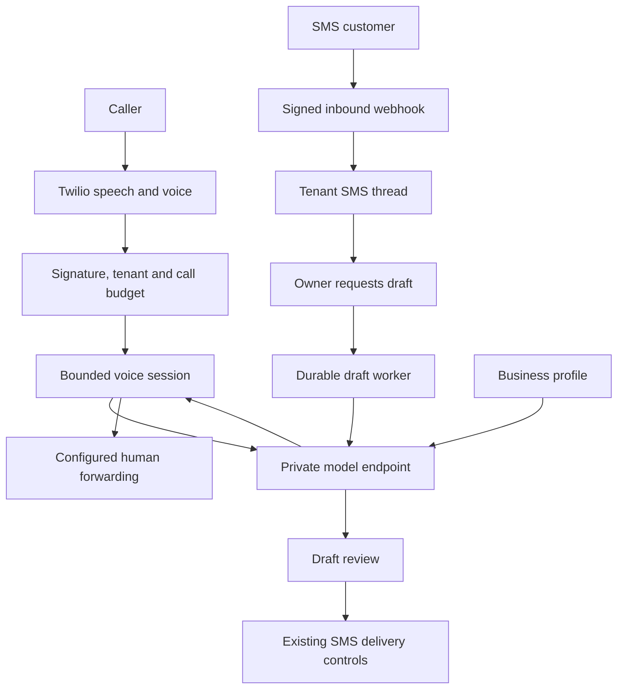

# AI receptionist architecture

Status: implemented, locally tested; not deployed or verified with live callers.

The tenant-owned business profile feeds one bounded text generation service. It supports SMS reply drafts and inbound speech-based phone conversations. The model has no tools, credentials, database access, booking authority, email authority or payment authority. Tenant-authored business information is the only business knowledge source. Answers can still be wrong: evaluate the selected model against each business's actual questions before activation.



## Data and isolation

- `ai_profiles`: one owner-managed profile per tenant, independent SMS/voice switches, factual business information and greeting. Both switches default off.
- `ai_jobs`: one draft per inbound message, unique database constraint. Atomic worker claiming; generating jobs are not automatically retried after a process crash. This conservatively avoids duplicate billable model calls.
- `voice_sessions`: keyed by provider CallSid, linked to the tenant's budget-reserved Call. History is encrypted with the existing encryption key; at most twelve history messages are retained in each session. Calls do not inherit SMS history or other callers' history.
- Each generation request is counted in the tenant's daily AI audit ledger. Default 100 requests per tenant per UTC day. Voice greeting uses one quota slot; each model turn uses another. This is a request limit, not a monetary provider spending guarantee.
- SMS context includes only delivered/sent outbound and received inbound messages from that tenant, number and peer, up to the selected inbound message. Drafts are neither customer-visible messages nor automatic sends.
- Model URL and credentials are server configuration, never tenant input. Local private Ollama and compatible hosted model APIs use `/v1/chat/completions`. Response size, text length and network timeouts are bounded; redirects and implicit HTTP retries are disabled.

## Voice lifecycle

1. Twilio POSTs the existing signed voice webhook. The application checks the number, paid account, tenant approval and Twilio spending threshold, then reserves up to ten minutes from the monthly call allowance.
2. An enabled profile produces `<Gather input="speech dtmf">` with an explicit AI disclosure. Caller speech recognition and speech synthesis are provided by Twilio. Zero requests a person.
3. Each turn has a random token. The signed action webhook locks the tenant/session, checks the current token, budget and settings, then requests a short model answer. The previous turn's XML is cached for duplicate provider requests. Older tokens are rejected.
4. A request for a human, empty speech, model failure, disabled profile, daily AI limit, eight-turn limit or approaching time budget uses the saved forwarding destination, or ends politely if no person is configured. No model output controls dial destinations.
5. Forwarded calls use a bounded `<Dial>` action; final provider callbacks reconcile whole-call duration. Number provisioning sets the completion callback. Existing numbers must be updated manually to use that callback before AI voice activation.

This is a turn-based receptionist. It does not use ConversationRelay, raw audio streams, interruptions, outbound AI dialling, recording, or continuous low-latency speech. The Twilio Developer Kit identifies ConversationRelay as the next architecture for streaming managed speech; migrating requires a signed WebSocket connection, load/latency testing, interruption handling, and session recovery.

## Setup

Configure the existing secret environment (never commit a model key):

```
AI_URL=http://ollama:11434/v1
AI_MODEL=<installed compatible model name>
AI_API_KEY=
AI_DAILY_REQUESTS=100
```

The example assumes a private Ollama service already exists on the container network. This repository does not download a model, deploy a GPU service, or expose Ollama to the Internet. For a hosted provider, use its HTTPS Chat Completions base URL, appropriate model and secret key. Verify provider retention terms, data processing agreement, region, model quality and spending limits before transmitting real customer conversations.

Run `python -m alembic upgrade head`, restart API and worker, sign in as the account owner, open **AI receptionist**, enter accurate business details and enable the desired channels. An approved active account is required for generation/calls. Use the existing forwarding settings for human transfer. Public AI-plan checkout remains unavailable until commercial launch checks are completed; this implementation does not change live prices or existing Stripe subscriptions.

## Production verification still required

- A real inbound Twilio test call: speech transcription, language/voice quality, mobile/network latency, no-speech fallback, zero transfer, caller hangup and complete duration callback.
- Model answer evaluation: unknown facts, prompt injection, personal disclosures, emergency situations, and business questions. Prompt instructions are guidance, not a formal content safety guarantee.
- Load testing: voice generation holds a tenant lock during a bounded provider call to serialize quotas/turns. Same-tenant calls and drafts can contend; provision capacity and measure before public sale.
- Operator-controlled AI endpoint connectivity and health, TLS if hosted, provider quota, latency and real usage costs. No secondary model provider is silently used.
- Privacy notice and transcript/draft retention schedule. Encrypted histories are currently retained with the account and must be included in access/deletion requests. No automated retention purge yet.
- If a draft is stuck in `generating`, verify provider usage before resetting its status. Do not blindly retry expensive requests after an ambiguous result.

## Next integrations

Calendar booking and outbound business email need tenant-authorized connectors, explicit action validation, customer confirmation and durable idempotent action jobs. They are not simulated by the model. WhatsApp/RCS need approved senders and channel-specific routing first. ConversationRelay adds streaming voice after the above live checks.
