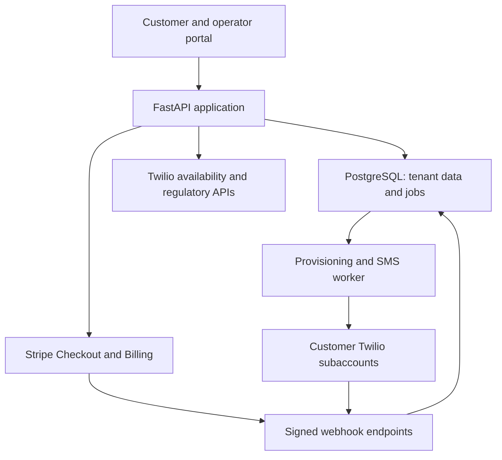

# Raeburn Communications — architecture

## Product and boundaries

A UK business communications application: customer subscriptions include a dedicated number, UK call forwarding, and (on Connect) SMS with a threaded inbox. The underlying number is provisioned for the customer's service, rather than sold as property. The application is an ISV with one Twilio subaccount per legal business. Parent-account billing remains Raeburn's responsibility; subaccounts do not remove shared commercial, fraud or platform risks.

This repository was empty on 1 October 2026. No earlier SMS/AI application, database or sender registrations have been imported. The UK numbers/calls/SMS release now includes commercial launch hardening described in [LAUNCH.md](LAUNCH.md). Live provider configuration and acceptance are still outstanding.

## System

The browser uses same-origin authenticated API calls. Secure HttpOnly cookies hold opaque random session tokens; only hashes are stored. Mutations require the configured public Origin and a custom request header. PostgreSQL is mandatory in production. SQLite is for development and tests only. External side effects run in a separate worker and require approved customer identity and an active subscription. Reverse proxy TLS terminates at the public URL; untrusted proxy headers are not used to construct signature URLs.

## Service catalogue and commercial model

| Product | Implemented scope | Commercial decision |
| --- | --- | --- |
| Business Number | One UK number, UK call forwarding | Operator-configured Stripe recurring price |
| Connect | Business Number plus SMS inbox and replies | Operator-configured Stripe recurring price |
| AI Receptionist | SMS drafts and turn-based voice implemented; checkout disabled pending launch | Set price after model, messaging and integration costs are measured |
| Additional / vanity numbers | Search supports digit patterns; one number limit | No scarcity markup or inventory holding implemented |
| WhatsApp / RCS | Separate non-active statuses shown | Per-customer registration and commercial approval required |

Earlier £9.99/£19.99/£39.99 suggestions are not validated price quotes. Calculate contribution margin as subscription revenue excluding VAT minus number rental, inbound/outbound call legs, SMS segments and carrier fees, channel costs, model costs, payment fees, support, refunds, fraud losses and fixed allocation. Stripe handles fixed subscriptions here. Usage metering and pass-through invoices are not implemented; pilot usage terms must be agreed separately. Do not advertise unlimited usage.

## Onboarding and number lifecycle

1. Operator opens pilot registration only when draft terms and manual support process are suitable.
2. Business creates account and accepts versioned draft terms. Owner submits legal name, registration number and address. Changing identity invalidates approval.
3. Platform administrator creates/reconciles a customer Twilio subaccount. API key credentials and webhook Auth Token are encrypted with Fernet. API keys are used for customer API calls; parent credentials are restricted to subaccount lifecycle and inventory search.
4. Operator completes Twilio end-user information, supporting documents and bundle submission in the customer's subaccount. No identity documents are uploaded into this application.
5. Administrator verifies bundle via Twilio. The API checks current approved status, GB country, business end-user type and number type. Operator must additionally check that bundle documents represent this exact customer. Address SID is checked in that subaccount where supplied.
6. Owner subscribes via Stripe hosted Checkout. Stripe's signed subscription webhook retrieves current provider state and maps its customer and configured price to the tenant. Redirect success never activates billing. Active status also requires the current expanded latest invoice to be paid. Open Checkout sessions are reused and a competing plan is blocked.
7. Owner searches current UK inventory and requests a number with an idempotency key. This does not reserve inventory. Approval, type, billing and one-number limit are enforced before creating the durable order.
8. Worker leases the order, rechecks approval and attaches bundle/address. It first looks for an existing number tagged with the exact order ID. This reconciles a remote success followed by a local crash.
9. Provider errors result in `review`; no automatic repeated purchase. Operator checks the provider and uses `retry-order` only after reconciliation. Unavailable inventory requires selecting a replacement through a support workflow; automatic substitution/refunds are not implemented.
10. Number becomes active in the tenant portal. Channel capabilities come from the actual purchased number.

States: customer `pending -> approved`; billing `unpaid -> active -> past_due/canceled/...`; order `queued -> processing -> active` or `review`. Cancellation blocks new outbound activity and forwarding. It does not automatically release numbers or cancel Twilio rental: the operator must handle retention, port-out and release under the customer's contract. Emergency access, location routing and reliable callbacks are not provided by this application.

## Customer isolation and data model

| Entity | Ownership / purpose |
| --- | --- |
| Tenant | Legal identity, approval, provider subaccount, subscription, plan, provider budget |
| User / Session | Tenant-scoped user, role, platform administrator flag, expiring session |
| Number | Tenant-owned number, provider SID, capability and forwarding configuration |
| Order | Tenant-scoped idempotent purchase request and durable job lease |
| Message | Tenant + number + channel + peer, direction, body, provider SID and status |
| Suppression | Tenant/recipient opt-out; blocks manual and queued sends |
| Event | Processed external event IDs for webhook replay protection |
| Audit | Actor and action records without message bodies or credentials |
| RateBucket | Shared durable rate limiting counters |

Customer-facing number/message lookups always filter by authenticated tenant; the browser never supplies the effective tenant. Thread key is tenant, owned number, channel and remote peer. The inbox displays up to 1,000 recent messages to build threads and 200 messages per conversation; indexed pagination and persisted conversation counters are required for scale. Platform administration is separate from tenant-owner authorization. Authenticator MFA, verified email and account recovery are implemented. Team invitations, granular agent permissions, RLS and SSO are future work.

## Messaging, callbacks and forwarding

SMS outbound request commits a queued message before calling Twilio. Worker checks current subscription, approval, opt-outs and provider monthly USD usage before sending. UK destinations only; local daily conservative UCS-2 segment cap is 100, with a configurable monthly allowance reserved on message creation. A provider timeout leaves `review` to avoid a duplicate SMS. A crash after marking `sending` requires manual reconciliation. There is deliberately no claim of exactly-once delivery across the provider boundary.

Twilio callbacks use SDK validation with the customer's encrypted Auth Token and an explicitly configured canonical URL, including query string. Incoming SMS SID is deduplicated transactionally. STOP-family messages suppress the sender across the tenant; START/UNSTOP remove the suppression. Configure and test provider-side opt-out handling as well before production. Attachments, HELP automation, WhatsApp session/template rules and RCS callbacks are not implemented.

Message status callbacks update matching tenant/provider SID only. Older states do not overwrite delivery; a callback arriving before the worker stores SID gets 503 so delivery is retried. Operators must still reconcile missing callbacks with provider logs.

Calls receive signed inbound Voice webhooks. Approved, active customers can forward to configured UK 01/02/07 destinations, with a 20-second ring timeout and up to ten reserved minutes per call from a configurable monthly allowance. Monthly provider budget is checked before forwarding. Loop detection covers self-forwarding only. Provider cost totals lag; this is not a real-time hard financial guarantee; local usage allowances and forwarding reservations additionally limit customer activity. A forwarding reservation/completion ledger is implemented. Call recordings, voicemail, a call-history UI, SIP/WebRTC dialler, outgoing calls, and emergency calling are not shipped. Turn-based inbound voice AI is implemented; see [AI architecture](AI_ARCHITECTURE.md).

## Billing and risk controls

Hosted Stripe Checkout and Customer Portal keep card data outside Raeburn. Event signatures and tenant/customer ownership are verified. Subscription updates retrieve current state, so delivery order cannot revive a canceled account using an old payload. Unknown/multiple subscriptions require review rather than guessing ownership.

Subscription/invoice reconciliation and completed-checkout recovery run periodically in the worker. Production expansion still needs refunds/dispute handling, reconciliation of local allowance usage to provider invoices, validated cost estimates, prepaid overages or credit limits, and further fraud detection. Default provider threshold is 2,000 USD cents monthly per tenant, including rental/usage, and is an emergency pilot ceiling, not the customer's price. Provider-side usage alerts and operator suspension are mandatory companions. Calls already running and provider reporting delays can exceed this value.

## AI and action integrations (full target architecture)

| Component | Proposed implementation and boundary |
| --- | --- |
| AI receptionist | Per-tenant brand instructions, approved knowledge base, bounded history and model adapter; explicit AI disclosure |
| Action service | Typed tool requests, tenant scopes, allowlisted actions, idempotency keys and durable outbox |
| Calendar booking | Customer OAuth grant, encrypted refresh tokens, free/busy lookup, timezone-aware slot offer, confirmed event creation; prevent double booking |
| Email | Verified tenant sender or mailbox OAuth; thread-preserving replies; recipient/attachment validation and send confirmation policy |
| Handoff | Pause AI per thread, agent queue, explicit escalation and audit trail |
| Safety | Treat received messages/documents as untrusted; never allow model-selected tenant, credentials or arbitrary URLs; spending/time limits |
| WhatsApp | Per-customer sender onboarding; 24-hour customer-service window and approved templates outside it; consent and media support |
| RCS | Per-customer brand/agent approval, supported-region capability checks, consent, verified assets, delivery fallback policy |
| Voice AI | Media Stream worker, speech pipeline, interruption handling, recording consent where applicable, human fallback |

None of these integrations is represented as operational in this release. Import any existing Raeburn communications app only after reviewing its authentication, data ownership and webhook routes; never move parent-account numbers without an explicit migration mapping and rollback plan.

## UK launch workstream

Read current Twilio country requirements dynamically rather than assuming all UK number types require identical documents. UK bundle status is not a general telecom authorization. Assess Raeburn's communications-provider status and applicable Ofcom conditions, numbering rules, complaints/ADR, porting, emergency service representations and end-user contract obligations with qualified review before public launch. Establish UK GDPR roles, lawful basis, privacy notice, retention/deletion, subject-access/export, subprocessors and breach procedures. PECR consent requirements depend on recipients, message purpose and subscriber type; a checkbox in this pilot is a sending control, not proof that marketing is lawful.

No mass outreach, number hoarding, unsupported OTP use or standalone number arbitrage is part of this design. Verify Twilio commercial terms for the proposed packaged service and any country-specific restrictions. Integrate abuse reporting and suspension, customer identity fraud checks, payment fraud checks and channel-specific sender registration.

## Deployment and operations

API + worker + PostgreSQL on a persistent host/container service (for example DigitalOcean). Use a TLS reverse proxy, database backups, private database connectivity, secret manager and restricted operator access. Vercel alone does not host this persistent worker design. A later Next.js frontend could be hosted separately, but would require a reviewed cross-origin auth strategy.

Production schema changes use explicit Alembic migrations (`python -m alembic upgrade head`). Development startup can create tables for local convenience. Existing pilot schemas need a verified baseline stamp before upgrade. Do not apply destructive changes at web startup. `/health` checks database availability and `/ready` checks configuration and worker heartbeat; add queue-age alerts before live service-level commitments. Ship redacted logs, alert on review orders/messages, failed webhook processing, budget breaches and payment drift. Back up PostgreSQL and encryption keys; rehearse restore and credential rotation.

## Sources checked on 1 October 2026

- https://www.twilio.com/docs/iam/api/subaccounts
- https://www.twilio.com/docs/phone-numbers/regulatory/reading-regulations-for-the-uk-bundle
- https://www.twilio.com/docs/phone-numbers/regulatory/api/bundles
- https://www.twilio.com/docs/usage/security
- https://docs.stripe.com/api/checkout/sessions
- https://docs.stripe.com/webhooks

These inform provider integration choices; the launch workstream is a list of required assessments, not legal certification.

## 0.2 commercial implementation update

The first release is UK numbers, calls and SMS. Account verification, one-use password recovery, encrypted SMTP outbox, TOTP MFA (mandatory for administrators), migrated schemas, subscription/invoice reconciliation, monthly local allowances, forwarding reservations/callback ledger, worker heartbeat and production HTTPS/backup scripts are now implemented. Consult [LAUNCH.md](LAUNCH.md) for the current deployment/acceptance state. No live-provider acceptance has been inferred from mocked tests.
